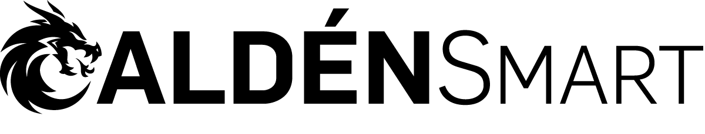

<!-- markdownlint-disable MD041 -->

---

### Índice

- [Descripción del proyecto](#descripción-del-proyecto)
- [Funciones](#funciones)
- [Aplicación](#aplicación)
- [Herramientas utilizadas](#herramientas-utilizadas)
- [Developers](#developers)

## Descripción del proyecto

Calden Smart es una aplicación desde la cual puedes controlar nuestros equipos de domótica, detectores de gas, calefactores, relés y mucho más. Utilizando las tecnologías más confiables, desde el Bluetooth con el cual podrás entablar una conexión segura y confiable hasta el WiFi con el cual podrás controlar tus equipos desde cualquier lugar del mundo.

## Funciones

- **Conexión a equipos por Bluetooth:** Puedes conectarte a los equipos y gestionarlos en base a tus necesidades. Por ejemplo, si tienes un calefactor puedes configurar su temperatura de corte.
  
- **Control de los equipos por WiFi:** Desde cualquier lugar puedes controlar tus equipos registrados que cuenten con conexión WiFi. Por ejemplo, si tienes un equipo de domótica, puedes encender/apagar las luces de tu casa.
  
- **Programación de eventos:** Programa tus equipos registrados ya sea para su control horario, accionarlos en cadena y más. Por ejemplo, que se apaguen los equipos seleccionados al sonar la alerta de un detector.

## Aplicación

Calden Smart es una versión mejorada de Biocaldén Smart Life, nuestra anterior aplicación, en la cuales trabajamos con marcas como Biocaldén, Caldén Calefactores e Intelligentgas.

Estas aplicaciones ya cuentan con una versión en Play Store, a la cual pueden acceder a través de los siguientes enlaces:

- **Calden Smart:** [https://play.google.com/store/apps/details?id=com.caldensmart.sime](https://play.google.com/store/apps/details?id=com.caldensmart.sime)
- **Biocaldén Smart Life:** [https://play.google.com/store/apps/details?id=com.biocalden.smartlife.sime](https://play.google.com/store/apps/details?id=com.biocalden.smartlife.sime)

## Herramientas utilizadas

<!-- markdownlint-disable MD033 -->

  
  
  
  

<!-- markdownlint-enable MD033 -->

## Developers

|  |  |
| :---: | :---: |
| [**Gonzalo Trillo**](https://github.com/Azthriel) | [**Javier Di Franco**](https://github.com/javaBD) |
